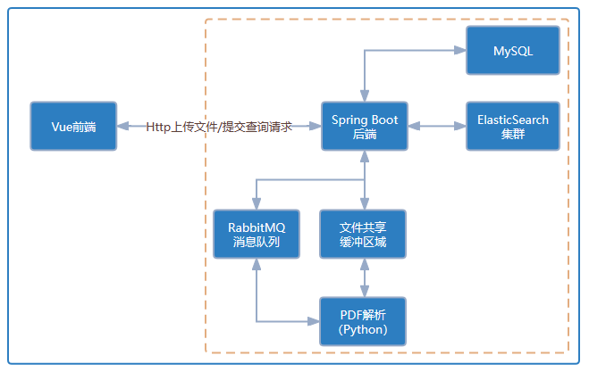

# 医学文献智能识别与检索系统

## 项目简介

医学文件作为医疗企业的核心资料，工作人员往往需要向医药代表快速且准确提供相关医学信息与文献，借助人工智能技术打造医学文献识别检索系统势在必行。

## 功能简介

本系统是一个为用户提供 PDF 格式医学文件的检索、上传、收藏、下载、预览等功 能的医学文献检索系统。下面是系统的主要功能：

**文献解析**：用户可以批量上传文件，系统将自动解析为可被检索的格式进行存储。

**文献检索**：用户可通过两种方式进行检索，可以选择全文检索，也可以选择高级检 索。高级检索可以选择按照输入分类检索，包括文章标题、作者、关键词、正文内容，
可按照三者的与或非关系进行检索；还可选择按照内容分类检索，如仅依据图片检索或 图文全检索。用户还可以针对特定文章检索。检索到文献后，用户可以在线阅读文献。

**文献管理**：用户可以在已解析列表中查看已上传的文献，对文献进行删除、下载、 预览或修改文献信息、设置文献权限等操作。还可在个人收藏中查看已收藏的文献，对
文献进行取消收藏、预览或下载操作。

## 系统架构图

系统采用前后端分离微服务架构，前端使用了Vue.js，后端使用了Spring系列框架，包括Spring Boot、Spring
Data等，同时使用了RabbitMQ、Elasticsearch和Nginx等作为中间件进行开发。



## 目录结构说明

> ```
> retrieve
> ```
>
> > `.gitignore` -- 忽略提交配置
> >
> > `README.md` -- 项目自述文件
> >
> > `documents` -- 环境搭建、编码规范、项目需求等等文档资源
> >
> > `retrieve-java` -- `Java`项目主体
> >
> > `retrieve-vue` -- 前端项目主体
> >
> > `retrieve-python` -- 算法项目主体

## 软件架构

### 后端技术

|      技术      |      说明      |  版本  |                             备注                             |
| :------------: | :------------: | :----: | :----------------------------------------------------------: |
|   SpringBoot   |    后端框架    | 2.7.7  |            https://spring.io/projects/spring-boot            |
| SpringData JPA | 数据持久化框架 | 2.7.7  |          https://spring.io/projects/spring-data-jpa          |
|  SpringWebMVC  |    MVC框架     | 5.3.24 | https://docs.spring.io/spring/docs/current/spring-framework-reference/web.html |

### 前端技术

|      技术      |    说明    |   版本   |                    备注                    |
|:------------:|:--------:|:------:|:----------------------------------------:|
|     Vue      |   前端框架   | 3.2.13 |            https://vuejs.org/            |
|  Vue-router  |   路由框架   | 4.1.6  |        https://router.vuejs.org/         |
|     Vuex     | 全局状态管理框架 | 4.0.2  |         https://vuex.vuejs.org/          |
|    Axios     | 前端HTTP框架 | 1.2.2  |      https://github.com/axios/axios      |
| Element-plus |  前端UI框架  | 2.0.10 |      http://element-plus.org/zh-CN/      |
|   echarts    |   图表框架   | 5.4.1  | https://echarts.apache.org/zh/index.html |

## 环境搭建

### 开发工具

|      工具       |       说明        |   版本   |                 备注                 |
|:-------------:|:---------------:|:------:|:----------------------------------:|
| IntelliJ IDEA |      开发IDE      | 2023.1 |  https://www.jetbrains.com/idea/   |
|    Pycharm    |     算法开发IDE     | 2023.1 | https://www.jetbrains.com/pycharm/ |
|    Navicat    |     数据库连接工具     |   16   |      https://navicat.com.cn/       |
|   ProcessOn   |     流程图绘制工具     | latest |     https://www.processon.com/     |
|    Postman    |    API接口调试工具    | latest |      https://www.postman.com/      |
|    Kibana     | Elasticsearch调试 | latest | https://www.elastic.co/cn/kibana/  |

### 开发环境

|      工具      |      版本       |             备注             |
|:------------:|:-------------:|:--------------------------:|
|   Windows    |      11       |            操作系统            |
|    macOS     |      13       |            操作系统            |
|     JDK      |  17.0.5 LTS   |    https://openjdk.org/    |
|    Python    |     3.11      |  https://www.python.org/   |
|    MySQL     |    8.0.31     | https://www.mysql.com/cn/  |
|    Tomcat    |    9.0.70     | https://tomcat.apache.org/ |
|    Maven     |     3.8.6     | https://maven.apache.org/  |
|   Anaconda   |    22.11.1    | https://www.anaconda.com/  |
|   RabbitMQ   | Stable 3.11.6 | https://www.rabbitmq.com/  |
| Elaticsearch |     7.3.2     | https://www.elastic.co/cn/ |
|    Nginx     |    1.23.3     |     https://nginx.org/     |
|    NodeJS    |  18.13.0 LTS  | https://nodejs.org/zh-cn/  |

## 特别鸣谢

本系统的诞生离不开开源软件和社区的支持，感谢一下开源项目及项目维护者：

- `Spring`：https://github.com/spring-projects
- `Vue.js`：https://github.com/vuejs
- `Element Plus`：https://github.com/ElemeFE
